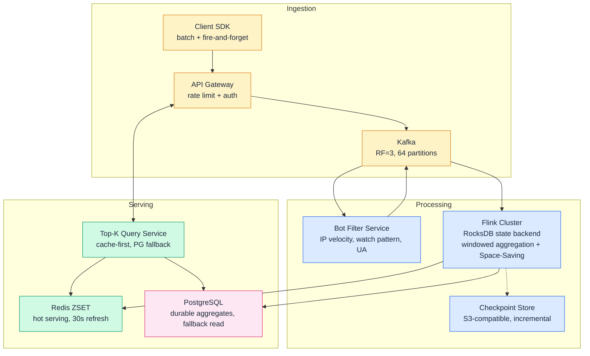
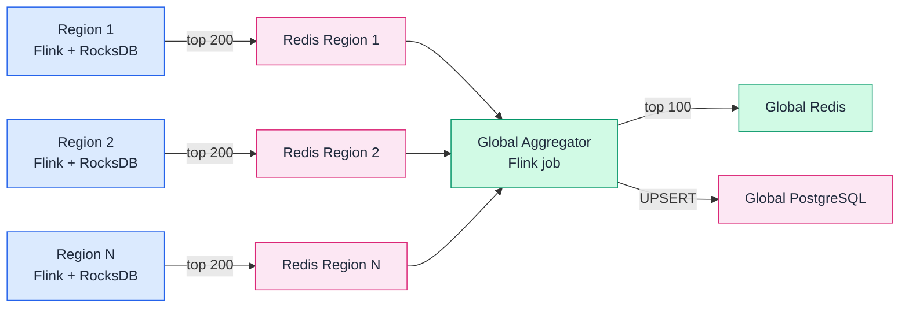

# System Design: YouTube Top-K Leaderboard

> Source: Notion System Design v2026.06.30.2
> Page ID: 390d865005a8816a9ba5ec00047880f6

## 1. Problem
YouTube ingests over 70 billion view events per day across more than 4 billion distinct videos, serving over 500 million daily active users who watch over a billion hours of content. A core product surface is the Top-K Videos feature — the leaderboard that answers "what is most-watched right now" across time windows from the last 10 minutes to all-time. The system must rank videos by view count within configurable time windows, handle sliding windows for real-time "trending now" scoring, serve results with sub-second freshness, and do so without materializing exact counts for all 4 billion videos — a 64 GB in-memory requirement that would blow any single-machine budget. The design must also support multi-tenancy: regional top-K lists (per country) and per-category breakdowns (music, gaming, news), all updated continuously as view events stream in at an average rate of ~810K events per second.

## 2. Requirements
Functional
- FR1: Return top-K videos by view count for a given time window
- FR2: Support tumbling windows at hour, day, and month granularity
- FR3: Support a sliding window for real-time "hot right now" results
- FR4: Serve results with metadata including freshness timestamp and region
- FR5: Support per-region and per-category top-K lists independently
- FR6: Tolerate component failure with no permanent data loss
Non-functional
- NFR1: Read latency under 100ms at the 95th percentile
- NFR2: Ingest 700K+ write events per second sustained
- NFR3: System availability of 99.9% across rolling failures
- NFR4: Memory footprint under 1 GB per time window for active tracking
Out of scope: Personalized top-K recommendations, video content storage and transcoding, authentication and authorization, billing.
## 3. Back of the envelope
- Write volume: 70B events/day ÷ 86,400s ≈ 810K events/sec average → peak ~2M events/sec → a single-threaded counter per key cannot keep up
- Exact storage for all videos (HashMap): 4B videos × 8 bytes per counter = 32 GB minimum → too large for in-memory real-time serving
- Approximate top-5000 via Space-Saving (m=5000): 5000 entries × ~24 bytes = 120 KB per window → 10,000× memory reduction versus exact counting; fits in bounded memory
## 4. Entities & API
```sql
Video {
    video_id:      string PK     -- immutable identifier
    title:         string
    category:      string        -- music | gaming | news | sports | ...
    region:        string        -- ISO country code
    upload_time:   timestamp
    status:        string        -- active | removed | private
}

ViewEvent {
    event_id:      string PK     -- UUID, idempotency key
    video_id:      string FK
    viewer_id:     string        -- anonymous or authenticated
    event_time:    timestamp     -- client-reported wall clock
    region:        string
    watch_seconds: int           -- seconds watched in this session
}

WindowAggregate {
    video_id:      string PK
    window_start:  timestamp PK  -- CK: composite key with video_id
    window_end:    timestamp
    view_count:    bigint        -- pre-aggregated count for the window
    unique_viewers: int          -- HLL cardinality estimate
    category:      string
    region:        string
}

TopKCache {
    window_key:    string PK     -- "topk:{window_type}:{start}:{region}:{cat}"
    rank:          int
    video_id:      string
    view_count:    bigint
    refreshed_at:  timestamp     -- when this entry was last computed
}
```
- GET /v1/top-k?window={WINDOW}&k={K}&region={REGION}&category={CAT} — return top-K videos for a tumbling window (hour/day/month), region and category optional
- GET /v1/top-k/trending?k={K}&region={REGION} — return top-K for the current 10-minute sliding window
- GET /v1/videos/{video_id}/count?window={WINDOW} — return the view count for a single video in a given window
- POST /v1/events/view — ingest a single view event (fire-and-forget, returns 202 Accepted)
- POST /v1/events/view/batch — ingest up to 500 batched view events
## 5. High-Level Design

The system follows a Lambda architecture with a fast streaming path for real-time approximate results and a slow batch reconciliation path for durable exact counts. Events enter through Kafka, which acts as the durable source of truth (replication factor 3, 64 partitions keyed on video_id). A bot-filtering consumer scores events on IP velocity, watch duration distribution, user-agent consistency, and session replay patterns — emitting only clean events to a downstream topic. Flink consumes the clean stream, maintains per-video windowed state in RocksDB (off-heap, checkpointed to object storage), and periodically flushes aggregated top-K lists to Redis sorted sets and PostgreSQL. The Top-K Query Service reads from Redis with a cache-first strategy, falling back to PostgreSQL when Redis is unavailable. Redis is treated as a disposable cache, never the source of truth — it is repopulated from Flink state on restart.
#### FR1: Return top-K videos for a given time window
Components: Top-K Query Service → Redis ZSET → PostgreSQL fallback
Flow:
1. Client calls GET /v1/top-k?window=day&k=50&region=US
1. Query Service builds the cache key topk:day:2026-06-30:US:* and issues ZREVRANGE with LIMIT 0 49
1. On cache hit, the sorted set returns the top 50 (video_id, count) tuples in sub-millisecond time
1. On cache miss or Redis unavailability, Query Service falls back to PostgreSQL: SELECT video_id, view_count FROM window_aggregates WHERE window_start >= $1 AND window_end <= $2 AND region = $3 ORDER BY view_count DESC LIMIT $4
1. Results are decorated with a refreshed_at timestamp from the cache entry and returned to the client
Design consideration: The cache TTL is set to 30 seconds for tumbling windows and 5 seconds for the trending sliding window. A background refresher cron job inside the Query Service pre-warms the cache 5 seconds before expiry to prevent cache-stampede misses. When a cache miss does occur, request coalescing ensures only one in-flight query to PostgreSQL per cache key — concurrent callers wait on a promise for that single result.
#### FR2: Support tumbling windows at hour, day, and month granularity
Components: Flink tumbling window aggregator → PostgreSQL → Redis ZSET
Flow:
1. Flink consumes clean_view_events from Kafka, grouped by video_id
1. A tumbling window of 1 hour aggregates COUNT(*) per (video_id, region, category) tuple
1. At window close, Flink executes an UPSERT into the window_aggregates table: INSERT ... ON CONFLICT (video_id, window_start) DO UPDATE SET view_count = window_aggregates.view_count + EXCLUDED.view_count
1. A co-located Flink operator runs a min-heap of size K against all rows in the current window, selecting the top K and issuing ZADD topk:hour:2026-06-30T14:00:00 {video_id} {count} for each entry
1. For day and month windows, Flink consumes the pre-aggregated hour-level rows rather than raw events, summing across hour buckets — reducing data volume by a factor of hours-per-window
Design consideration: Writing pre-aggregated hour buckets instead of raw events into the day and month paths avoids re-scanning billions of raw events. The day window reads at most 24 hour-bucket rows per video; the month window reads at most ~720. This transforms an O(N) full scan into an O(V × H) indexed lookup where V is the number of active videos and H is the number of hour buckets in the window. The window_aggregates table is indexed on (window_start, region, category, view_count DESC) so the ORDER BY ... LIMIT K query uses an index-only scan.
#### FR3: Support a sliding window for real-time "hot right now"
Components: Flink hop windows + Redis ZSET with short TTL
Flow:
1. Flink uses HOP(TABLE view_events, DESCRIPTOR(event_time), INTERVAL '1' MINUTE, INTERVAL '10' MINUTES) — this creates 10 overlapping 10-minute windows, each advancing by 1 minute
1. Each hop window triggers a top-K computation at its close, writing results to topk:trending:{window_start} in Redis with a 15-minute TTL
1. The Query Service reads the most recent complete window's ZSET: topk:trending:{now - 10min}
1. For sub-minute freshness during the current incomplete window, the Query Service also reads a "live" ZSET populated by Flink every 5 seconds using processing-time mini-batch aggregation
1. The live ZSET is merged with the last complete window's ZSET via a client-side merge: sum counts for videos appearing in both, take the top K
Design consideration: Hop windows produce 10× the output of tumbling windows (one trigger per minute instead of one per 10 minutes). To avoid overwhelming Redis, only the top 100 entries per window are written, and obsolete windows are pruned naturally by TTL. The live ZSET uses a Space-Saving sketch inside Flink rather than full aggregation — the sketch tracks heavy hitters with bounded error during the incomplete window, then the complete window result (exact) replaces it at window close. This balances freshness against accuracy.
#### FR4: Serve results with metadata including freshness timestamp and region
Components: Top-K Query Service
Flow:
1. Each cache entry in Redis carries a refreshed_at field stored as the ZSET member's score suffix or in a parallel hash: topk:meta:{window_key} → {"refreshed_at": "2026-06-30T14:01:30Z", "region": "US", "window": "day"}
1. Query Service reads both the ZSET and the metadata hash in a Redis pipeline (two commands, one round trip)
1. Response payload includes: {results: [{video_id, count, rank}], metadata: {window, region, refreshed_at, k}}
Design consideration: The refreshed_at timestamp is generated by Flink when it writes the ZSET, not by the Query Service on read. This gives clients a truthful signal about data staleness rather than a misleading "query time" that hides pipeline delay. If the metadata hash is missing (Redis restart), the Query Service synthesizes it from the current server clock with a stale: true flag so the client can decide whether to retry.
#### FR5: Support per-region and per-category top-K lists independently
Components: Flink → Redis ZSET (partitioned by region and category)
Flow:
1. Flink aggregates views keyed by (video_id, region, category) within each window
1. The top-K operator runs independently for each (region, category) combination, maintaining one min-heap per combination
1. Results are written to separate Redis keys: topk:day:2026-06-30:US:music, topk:day:2026-06-30:US:gaming, topk:day:2026-06-30:GB:music, etc.
1. The Query Service constructs the cache key from query parameters — missing parameters use a wildcard * key that contains the global (unfiltered) top-K
1. For cross-region or cross-category queries (e.g., "music across all regions"), a separate global aggregator Flink job merges per-region top-K lists into a combined ZSET
Design consideration: The number of (region, category) combinations is bounded (~200 countries × ~20 categories = 4,000 combinations). Running 4,000 independent min-heaps inside Flink is tractable because each heap is small (100 entries, ~2.4 KB). The global aggregator merges at most K × num_regions entries (50 × 200 = 10,000) every 30 seconds, a lightweight operation. New region/category pairs are discovered dynamically from incoming events and allocated heaps lazily, avoiding pre-allocation for every possible combination.
#### FR6: Tolerate component failure with no permanent data loss
Components: Kafka (source of truth) + Flink checkpoints + Redis-as-cache + PostgreSQL fallback
Flow:
1. View events are durably stored in Kafka (RF=3, min.insync.replicas=2, acks=all) before the producer returns success
1. Flink checkpoints its RocksDB state and Kafka consumer offsets to object storage every 60 seconds (incremental checkpoints — only changed SST files)
1. On Flink job failure, a new job starts from the last checkpoint: replays Kafka from the stored offset, restores RocksDB state, and resumes aggregation
1. Redis failure: Query Service falls back to PostgreSQL for reads; Flink detects Redis unavailability and buffers ZADD commands with retry (exponential backoff, max 30s)
1. PostgreSQL failure: Flink buffers UPSERT commands in its checkpointed state; on PostgreSQL recovery, flushes the buffer
1. Kafka failure (broker loss): partition leader election completes within seconds, consumers reconnect; no data loss because acks=all
Design consideration: The system uses at-least-once semantics with idempotent sinks rather than full exactly-once two-phase commit. Redis ZADD overwrites the same score for the same member — replaying the same window result produces the same ZSET state. PostgreSQL INSERT ... ON CONFLICT DO UPDATE is idempotent by key. This achieves effectively-once semantics with roughly half the coordination overhead of a two-phase commit protocol, at the cost of transient duplicate processing that corrects itself at the sink layer. The trade-off is justified: the 30–50% throughput gain from avoiding distributed transactions outweighs the negligible cost of overwriting the same value twice.
## 6. Deep dives
### DD1: Scaling writes with counter sharding and batch aggregation
Problem. At 810K events/sec average (2M peak), incrementing a single counter per video creates a catastrophic bottleneck. Redis is single-threaded per key — INCR view_count:{video_id} saturates at ~100K ops/sec on a single key, meaning a viral video at 500K views/hour would monopolize a Redis thread. The write path must parallelize across many shards while still correctly summing the total count on reads.
Approach 1: Single-key increment with connection pooling
A single Redis key view_count:{video_id} is incremented per view event. Connection pooling distributes concurrent incr calls across many connections, but Redis serializes commands on the same key through its single event loop.
```javascript
INCR view_count:v_abc123   # every view on video v_abc123
```
Challenges: Redis can handle ~150K INCR ops/sec total, but only ~100K/sec on one hot key before the event-loop thread becomes CPU-bound. A viral video at 50M views/day (578/sec average, 5,000/sec peak burst from a Reddit link) creates a hotspot that starves other keys. Connection pooling doesn't help — the bottleneck is inside Redis, not at the network layer.
Approach 2: Database-level sharding by video_id range
Partition a PostgreSQL table by video_id hash into 128 shards. Each shard independently increments its row.
```sql
-- Shard selection: hash(video_id) % 128
UPDATE video_counts_shard_42
SET view_count = view_count + 1
WHERE video_id = 'v_abc123';
```
Challenges: Row-level locking on the hot row still serializes writes within a shard — a viral video's row in shard 42 blocks other videos hashing to the same shard. Additionally, reads require a scatter-gather across all 128 shards to compute the total, adding 128× read latency. Each write is a full SQL UPDATE with index maintenance and WAL logging, costing ~2–5ms per event — far too slow for 810K events/sec.
Approach 3: 128-shard Redis counters with batch aggregation
Maintain 128 Redis keys per video: view_count:{video_id}:{0..127}. The aggregation service buffers events in 500ms batches and emits INCRBY per shard rather than INCR per event.
```javascript
// Event arrives: {video_id: "v_abc123", viewer_id: "u_xyz"}
shard = hash(viewer_id) % 128
batch_buffer["v_abc123"][shard] += 1

// Every 500ms, flush:
REDIS INCRBY view_count:v_abc123:42 17   // 17 events on shard 42
REDIS INCRBY view_count:v_abc123:87 12   // 12 events on shard 87
// ... up to 128 INCRBY calls, pipelined

// Read: sum all 128 shards
REDIS MGET view_count:v_abc123:0 ... view_count:v_abc123:127
// → sum the 128 returned values → total view count
```
Normal path: A read arrives. The count service issues a single pipelined MGET across all 128 shard keys, sums the results in-memory, and returns the total. The pipeline completes in ~2–3ms regardless of how many shards have data.
Ramp-up: When a new video receives its first view, all 128 shard keys are created lazily. The first INCRBY on a non-existent key initializes it to the increment value. Reads that encounter missing keys treat them as zero.
Decision: Approach 3 (128-shard Redis counters with batch aggregation). At the peak write rate of 2M events/sec, 500ms batching compresses 1,000,000 individual increments into at most 128 INCRBY commands per video — a ~7,800× reduction in Redis round trips. The 128-shard fan-out converts a single-threaded bottleneck into 128 independent single-threaded operations, each handling ~1/128th of the total write load. The read penalty (128 MGET calls) is acceptable because reads are infrequent relative to writes (~1,000:1 ratio in a view-counting system) and the pipeline ensures the 128 reads cost only ~2–3ms total.
Rationale: The 128-shard count was chosen because Redis comfortably handles ~100K ops/sec on a single key before CPU saturation. With 128 shards, the theoretical ceiling rises to ~12.8M ops/sec — well above the 2M peak. In production, Redis clusters at similar scale observe that 64 shards suffice for ~500K/sec workloads; 128 provides headroom for viral spikes. The batch window of 500ms was chosen as the balance point: shorter windows reduce per-batch event count (fewer savings), longer windows increase end-to-end latency beyond acceptable freshness bounds.
Edge cases:
- Shard imbalance: A hash collision could concentrate events on a subset of shards. Using hash(viewer_id) rather than hash(event_id) distributes evenly because viewer IDs are uniformly random. In the worst case, a single viewer refreshing rapidly would land on one shard — but the rate limiter at the API Gateway caps single-viewer event rates at 10/sec, preventing this.
- MGET partial failure: If some shard keys are on a different Redis node (cluster mode), MGET across hash slots fails. The count service detects this, falls back to individual GET calls, and caches the slot mapping for subsequent reads.
- Counter overflow after Redis restart: Redis counters are lost on restart if not using AOF persistence. The reconciliation job (hourly) reads durable counts from PostgreSQL and re-seeds Redis shards, so the maximum data loss window is 1 hour. For videos with high view velocity, INCRBY on the re-seeded value quickly catches up; for low-velocity videos, the loss is negligible.
> [!NOTE]
> 💡 Why batching is the unsung hero here. A common instinct is to shard aggressively and call it done, but batching is what makes sharding economically viable. Without batching, even 128 shards would field 810K individual INCR calls per second — ~6,300 calls/sec per shard, consuming non-trivial Redis CPU. With 500ms batching, the same 128 shards field ~256 INCRBY calls/sec total — a 3,000× reduction. The batch buffer itself is a simple in-memory Map<video_id, int[128]> costing ~1 KB per active video in the aggregation worker; with ~100K active videos per worker, that's ~100 MB of JVM heap — cheap at the scale we're operating at.
---
### DD2: Sliding windows — hop windows vs. ring buffers vs. double-pointer stream consumption
Problem. A 10-minute sliding window that refreshes every minute must answer "top-K videos in the last 10 minutes" with sub-minute staleness. Unlike tumbling windows where each event belongs to exactly one window, sliding windows create overlapping intervals: an event at time T belongs to up to 10 windows (if the window slides every minute). Computing the top-K from scratch every minute by re-aggregating the last 10 minutes of raw events would require scanning 10 × 60s × 810K = 486M events per computation — infeasible at 1-minute cadence.
Approach 1: Flink hop windows
Use Flink's native HOP window TVF to maintain 10 overlapping 10-minute windows, each advancing by 1 minute. Every event is assigned to all windows it falls within; Flink manages state per window slice internally.
```sql
SELECT video_id, window_start, window_end, COUNT(*) AS view_count
FROM HOP(
    TABLE clean_view_events,
    DESCRIPTOR(event_time),
    INTERVAL '1' MINUTE,
    INTERVAL '10' MINUTES
)
GROUP BY video_id, window_start, window_end
```
At each window close, a Window Top-N query selects the top K from the completed window and writes to Redis.
Challenges: Hop windows with a 1-minute slide and 10-minute size create 10 active windows simultaneously. Flink maintains separate RocksDB state for each window, effectively storing 10 copies of the aggregation state — ~10× the memory of a single tumbling window. For 100K active videos, 10 windows × ~200 bytes per video-state = 200 MB of RocksDB state per task manager, manageable but worth noting. Additionally, each event is processed 10 times (once per window assignment), increasing CPU by 10× relative to a single-window aggregation.
Approach 2: Ring buffer of minute-level buckets
Maintain a circular buffer of 10 minute-bucket aggregates, plus a running total. Each new minute: add the incoming minute's aggregates to the total, subtract the outgoing (11th) minute's aggregates, write the new total as the current window result.
```javascript
// State: 10-element ring buffer, each element is Map<video_id, count>
buckets: [M0, M1, M2, ..., M9]   // minute-level aggregate maps
running_total: Map<video_id, count>  // sum of all 10 buckets

// Every minute tick:
incoming = aggregate_events_for_past_minute()
outgoing = buckets[oldest_slot]
for each (video_id, count) in incoming:
    running_total[video_id] += count
for each (video_id, count) in outgoing:
    running_total[video_id] -= count
    if running_total[video_id] <= 0:
        delete running_total[video_id]
buckets[oldest_slot] = incoming
emit_top_k(running_total)
```
Normal path: At each minute boundary, the aggregator reads the current minute's pre-aggregated counting sketch, adds it to the running total, subtracts the bucket from 10 minutes ago, and emits the updated top-K. The computation is O(V) where V is the number of videos with non-zero counts in the active set — typically tens of thousands, not billions.
Challenges: The ring buffer requires maintaining exact minute-level aggregates for all videos, not just the top-K candidates. At 810K events/sec, a single minute bucket contains ~48.6M events across potentially millions of distinct videos. The running_total map grows to include every video that received at least one view in the last 10 minutes. Even at moderate cardinality (~10M distinct videos in 10 min), this map requires 10M × 24 bytes = 240 MB — within bounds but not trivial. More critically, the addition/subtraction loop on 10M entries per minute takes ~100ms of CPU time, risking backpressure on the event stream.
Approach 3: Double-pointer stream consumption with two Kafka consumer groups
Two independent Kafka consumer groups consume the same topic. The leading consumer processes live events and increments a Space-Saving sketch. The trailing consumer reads events from exactly 10 minutes ago (using Kafka's offset-by-timestamp API) and decrements counts from the same sketch.
```javascript
// Leading consumer: increments
for event in live_stream:
    sketch.add(event.video_id)

// Trailing consumer: decrements (reads 10min behind)
for event in delayed_stream:
    sketch.remove(event.video_id)

// Top-K query reads from sketch at any time
top_k = sketch.get_top_k(K)
```
Normal path: The sketch always reflects the exact 10-minute trailing window because the trailing consumer subtracts events as they fall outside the window. No periodic full recomputation is needed — the sketch updates continuously.
Challenges: This approach doubles Kafka read throughput (two consumer groups reading the full firehose) and requires a Space-Saving sketch that supports deletions. Standard Space-Saving does not support removal — you must extend it with a separate "tombstone" mechanism or use a different sketch (like a Count-Min Sketch with per-item heap, which does support decrements but loses the identity-tracking property). Kafka must retain 10+ minutes of events at all times (easily satisfied with default 7-day retention). The trailing consumer can fall behind under load, causing the window to silently expand — the system must monitor the trailing lag and alert.
Decision: Approach 1 (Flink hop windows) for the primary serving path, with Approach 2 (ring buffer) as the mechanism inside Flink's operator state. Flink hop windows provide battle-tested exactly-once state management, checkpointing, and late-event handling that hand-rolled ring buffers lack. Internally, Flink's hop window implementation uses a slice-based aggregation that shares state across overlapping windows, avoiding the 10× memory factor described above: Flink creates 10 one-minute slices and combines them on-the-fly, storing each event's count only once in its designated minute slice.
Rationale: Flink's hop windows handle the correctness edge cases that sink ad-hoc implementations: late events (arriving after the watermark) are routed to the correct minute slice or a side output; window state is checkpointed so crash recovery is automatic; and the optimizer merges overlapping window computations to avoid redundant work. The ring buffer approach (Approach 2) is correct in principle but adds operational complexity: the running total can drift due to late arrivals or missing minute-bucket data, requiring periodic full reconciliation. The double-pointer approach (Approach 3) is elegant in theory but the lack of standard Space-Saving delete support forces a custom sketch implementation — a maintenance liability when Flink's built-in primitives already solve the problem.
Edge cases:
- Late events beyond the allowed lateness (30s watermark delay): Routed to Flink's side output, written to a dead-letter topic, and reconciled by a daily batch job that corrects the durable aggregates in PostgreSQL. The real-time top-K may miss these views for up to 24 hours, but the error is bounded: late events represent <0.1% of total traffic.
- Window boundary alignment with clock skew: Client-reported event_time can differ from server time by seconds. Flink uses watermarks with a 30-second allowed lateness to accommodate clock skew without indefinitely holding window state open.
- Empty windows (no events in 10 minutes): The Query Service returns the last known top-K with a stale: true flag rather than an empty list, because "nothing is trending" is a worse user experience than "here's what was trending 10 minutes ago."
> [!NOTE]
> 💡 Hop windows with slice sharing. The key performance insight is that Flink does not store 10 separate copies of aggregation state for 10 overlapping windows. Instead, it partitions time into aligned 1-minute slices and tracks which slices belong to which window. When window [T+0, T+10] closes and window [T+1, T+11] becomes active, only the boundary slices change — the 9 interior slices are shared. A view event at minute M lands in exactly one slice; that slice's aggregate is referenced by up to 10 windows but stored once. This is why Flink's hop window memory overhead is O(slices) not O(windows × slices).
---
### DD3: Approximate counting — Count-Min Sketch vs. Space-Saving
Problem. Tracking exact view counts for all 4B+ videos in memory would require ~32 GB. At YouTube's write rate, even a well-sharded Redis cluster would struggle with the memory footprint of exact per-video counters for the active set of ~50M videos receiving views in a given window. We need an approximate data structure that trades a bounded, quantifiable error rate for a drastic reduction in memory — from gigabytes to kilobytes — while still correctly identifying the top K items with high confidence.
Approach 1: Count-Min Sketch with a separate min-heap
A Count-Min Sketch (CMS) is a matrix of counters with d rows and w columns. Each row has an independent hash function mapping items to columns. To increment an item's count, increment the counter at CMS[row][hash_row(item)] for all d rows. To estimate an item's count, take min(CMS[row][hash_row(item)] for all rows). To find the top-K, a separate min-heap of size K+δ is maintained alongside the sketch.
```javascript
// Sketch parameters: width w = ceil(e/epsilon), depth d = ceil(ln(1/delta))
// epsilon=0.001, delta=0.01 → w=2719, d=5 → 13,595 counters × 4 bytes = 54 KB

cms: int[d][w] = 0
heap: MinHeap[Counter] of size K+100  // K=100, δ=100

function add(item):
    for row in 0..d-1:
        col = hash_row(item) % w
        cms[row][col] += 1
    estimated = estimate(item)
    heap.upsert(item, estimated)
    if heap.size() > K + 100:
        heap.poll_min()

function estimate(item):
    return min(cms[row][hash_row(item) % w] for row in 0..d-1)

function get_top_k():
    return heap.sorted_desc()[:K]
```
Challenges: CMS overestimates counts — estimate(item) ≥ true_count always, and the error is bounded by epsilon × total_count with probability 1 - delta. For top-K, this means an item with true count 100 and another with true count 98 could be misordered if the overestimate on the 98-count item pushes it above 100. The heap must be periodically rebuilt from the sketch (O(heap_size × d) per rebuild) or maintained incrementally, which risks drift. More critically, CMS does not track item identities — the heap is a separate structure that must be kept in sync. If an item falls out of the heap, its identity is lost even though its approximate count lives in the sketch.
Approach 2: Space-Saving (Stream-Summary) with identity tracking
Space-Saving maintains exactly m counters, each tracking an (item, count, error) tuple. On each new event: if the item is already tracked, increment its counter. If not, and space remains, add a new counter. If the structure is full, evict the minimum-count item and replace it with the new item, inheriting the evicted item's count as the new item's error bound.
```javascript
m = 5000  // track up to 5000 candidates

counters: Hash<item, Counter>  // maps item → (count, error)
min_heap: BinaryHeap<Counter>  // ordered by count, for fast min lookup

function add(item):
    if item in counters:
        counters[item].count += 1
        update_heap_position(item)
    elif len(counters) < m:
        counters[item] = Counter(count=1, error=0)
        heap.push(counters[item])
    else:
        min = heap.peek_min()
        evicted = min.item
        counters.remove(evicted)
        counters[item] = Counter(count=min.count + 1, error=min.count)
        heap.replace_min(counters[item])

function get_top_k(k):
    return heap.items_sorted_desc()[:k]
    // For each result: guaranteed_count = count - error
```
Normal path: With m=5000 and K=100, the structure has 50× over-provisioning. A new item needs to accumulate more views than the current 5000th-place item to enter the tracked set. Once tracked, its count is exact (error=0 after the initial insertion). Items that fall out of the tracked set may later re-enter with an inflated error bound if their true count surpasses the current minimum — but by definition, items that fall out are far from the top K, so this doesn't affect top-K accuracy.
Challenges: Space-Saving does not support decrements. For sliding windows where events must age out, you cannot simply subtract an old count from a Space-Saving counter. The workaround is per-time-slice counters: maintain a separate Space-Saving sketch for each minute bucket, and compute the sliding window top-K by merging sketches. Merge is approximate (take the top m entries across all sketches, sum their counts). Also, Space-Saving is not mergeable in the CMS sense (where you can add sketches element-wise) — you must run a merge procedure that combines sorted lists.
Decision: Space-Saving for per-window heavy-hitter tracking, with Count-Min Sketch as the minute-bucket aggregation primitive for sliding windows (where mergeability is required). The core insight: Space-Saving is purpose-built for top-K; CMS is a general-purpose frequency estimator. For tumbling windows (hour, day, month), we use Space-Saving directly in Flink: maintain m=5000 counters per window, write the top-K to Redis at window close. For the sliding window's minute-bucket ring buffer (DD2), each minute bucket uses a Count-Min Sketch because we need to add (new minute) and subtract (outgoing minute) counts, which requires mergeability. The sketch size per minute bucket: epsilon=0.0001, delta=0.0001 → w=27183, d=5 → 136K counters → 544 KB per bucket × 10 buckets = 5.4 MB total — negligible.
Rationale: Space-Saving's identity-tracking property is the decisive advantage for tumbling windows. CMS requires a separate heap that must be rebuilt or maintained alongside the sketch — an extra synchronization point that introduces bugs. Space-Saving's single structure means the tracked set is always consistent: every item in the structure has a count and error bound; there is no "count is in the sketch but the item isn't in the heap" race condition. The 50× over-provisioning (m=5000 for K=100) provides a safety margin: an item outside the top-5000 today isn't jumping into the top-100 tomorrow, so the bounded-error guarantee holds for the top-K results.
Edge cases:
- Zipfian distribution: YouTube views follow a power-law distribution — the top 1% of videos get 90%+ of views. This is favorable for Space-Saving because the heavy hitters stay in the tracked set permanently, never incurring the replacement penalty. The error bound applies primarily to items near the K-th cutoff where the count differences are small.
- Bursty new video: A brand-new video from a major creator can go from 0 to 1M views in minutes. With m=5000, it must surpass the 5000th-place count (likely in the hundreds for a 1-hour window) to enter the tracked set. Once it crosses that threshold, it enters with count = min_existing + 1, error = min_existing. Within a few more events, its true count overtakes the error bound and subsequent increments are exact. The brief period where it's outside the tracked set is invisible to top-K results — but during that ramp-up, its true count is below the top-5000 cutoff anyway, so this is correct behavior.
- Long-tail churn: The bottom of the tracked set (items 4000–5000) churns rapidly as low-count videos come and go. This churn is harmless — by definition, these items are far from the top-100 and their exact counts don't matter.
> [!NOTE]
> 💡 Memory at YouTube scale. A naive HashMap<video_id, count> for 50M actively-viewed videos uses ~50M × (32B key + 8B count) = 2 GB per window. Space-Saving with m=5000 uses 5000 × (32B key + 16B counters) = 240 KB per window — an 8,300× reduction. At YouTube's scale, this is the difference between fitting state in RocksDB's block cache (fast, in-process) and spilling to disk (slow, GC-pressure). The over-provisioning factor of 50 (m=5000 for K=100) costs only 5000 entries — it's the memory equivalent of tracking 1 second of view events — and buys us the guarantee that noise at the cutoff doesn't affect top-100 results.
---
### DD4: Global aggregation — scatter-gather with regional top-K merge
Problem. YouTube serves users across 200+ countries through 5–6 regional data centers. A single global Flink cluster processing all view events would introduce cross-region latency (100–300ms per event), violate data residency requirements, and create a single point of failure. Events must be processed regionally, with global top-K results synthesized from regional outputs. The global merge must be correct (no double-counting), fast (sub-second refresh), and resilient to regional failures.
Approach 1: Single global pipeline with cross-region Kafka mirroring
All view events are produced to a single global Kafka cluster (or mirrored across regions). One Flink job consumes all events and computes global top-K directly, then replicates the result to regional Redis instances.
```javascript
All regions → Global Kafka → Global Flink → Regional Redis replicas
```
Challenges: Cross-region network latency adds 100–300ms to every event's end-to-end pipeline. A single Flink cluster becomes a global SPOF — an outage in one region's data center takes down top-K for everyone. Data residency regulations (GDPR, CCPA) may prohibit user view events from leaving their origin region. The global Flink job must handle 5–6× the state of a regional job, and checkpoint sizes grow proportionally.
Approach 2: Regional Flink jobs with no global merge
Each region independently computes its own top-K from local events. Users in region A see region A's top-K; users in region B see region B's top-K. No global view exists.
```javascript
Region A events → Flink-A → Redis-A → Users in Region A
Region B events → Flink-B → Redis-B → Users in Region B
```
Challenges: This fails the product requirement for a global top-K view. A video trending worldwide (e.g., a World Cup goal) may appear in every region's top-10, but a user explicitly requesting "global top-K" expects a single authoritative list. Regional top-K lists diverge significantly: a K-pop video dominates in Korea but barely registers in Brazil; a cricket highlight trends in India but is invisible in the US.
Approach 3: Regional processing with a lightweight global merge aggregator
Each region runs its own Flink job processing local events, outputting a per-region top-M list (M=200, over-provisioned beyond K=100). A separate lightweight global aggregator Flink job consumes the per-region lists, merges them with a min-heap, and writes the global top-K to a global Redis instance.

Flow:
1. Each regional Flink job computes a Space-Saving tracked set of size m=200 (over-provisioned for K=100) and writes the top 200 to a regional Redis ZSET every 30 seconds
1. The global aggregator polls all regional Redis ZSETs, collecting at most 200 × 6 = 1,200 entries
1. It merges them: for entries appearing in multiple regions, counts are summed; for entries appearing in a single region, the count is used as-is
1. A min-heap of size 100 selects the global top 100
1. Result is written to a global Redis ZSET (topk:global:hour:2026-06-30T14:00:00) and UPSERTed to global PostgreSQL
1. The Top-K Query Service reads from the global Redis when no region filter is specified
Normal path: A user in Japan requests GET /v1/top-k?window=day&k=50 (no region filter). The Query Service reads the global Redis ZSET, which was last refreshed by the global aggregator at most 30 seconds ago. The response includes a refreshed_at timestamp so the client knows the staleness. A user in Japan requesting GET /v1/top-k?window=day&k=50&region=JP reads the regional Redis directly, getting fresher data (5-second refresh) scoped to Japan.
Challenges: The global merge is approximate — it assumes no single video has more than M=200 rank across all regions without appearing in any individual region's top-M. With M=200 and K=100, this is safe: a video that is 50th globally must be at least 50th in its strongest region. The more subtle issue is double-counting: the same view event could be produced in two regions (e.g., a VPN user). The regional Flink jobs use hash(viewer_id) to deterministically assign viewers to a single region, preventing double-counting at ingestion. VPN users are assigned to the region of the data center their traffic routes through, which is a known and acceptable imprecision (affects <1% of traffic).
Decision: Approach 3 (regional processing with lightweight global merge). The global aggregator's merge of ~1,200 entries every 30 seconds is computationally trivial (O(1200 × log 100) ≈ 8,000 operations), runs on a single Flink task manager, and adds at most 30 seconds of staleness to global results. Regional results remain sub-5-seconds fresh because they bypass the global merge path entirely.
Rationale: This architecture mirrors the physical topology of the internet: view events originate close to users, travel to the nearest data center, and are processed there. The global merge is the minimal cross-region data transfer — 200 entries × 6 regions × ~48 bytes = 57 KB every 30 seconds, versus streaming the full event firehose cross-region at ~810K events/sec. The 30-second global staleness budget is acceptable because the global top-K page is a lower-traffic surface than regional trending pages; users browsing "what's trending worldwide" tolerate slightly older data in exchange for the global view.
Edge cases:
- Regional Flink failure: The global aggregator skips the failed region for up to 5 minutes (configurable timeout). Stale entries from the failed region's Redis expire naturally via TTL. The global top-K may temporarily omit a video that is trending only in that region — the error is bounded by the failure duration.
- Network partition between regions: If the global aggregator cannot reach a regional Redis, it serves the global top-K from the remaining regions and alerts. No data is lost because all regional Flink jobs independently checkpoint to object storage and buffer their PostgreSQL writes locally.
- Cold start for a new region: When a new data center comes online, its regional Flink job starts from an empty state. It takes ~10 minutes of processing to build an accurate tracked set. During this warm-up, the global aggregator weights the new region's entries with a confidence factor (decaying from 0 to 1 over the warm-up period) to prevent an initially-empty region from diluting global results.
> [!NOTE]
> 💡 Why the global merge is a min-heap and not a distributed sort. Merging top-K lists from N regions to produce a global top-K is the classic "merge K sorted lists" problem, solved by a min-heap in O(N × K × log K). With N=6 regions and K=100, this is 600 × log₂(100) ≈ 4,000 comparisons — a few microseconds of CPU. Contrast this with the instinct to run a distributed ORDER BY ... LIMIT K across regional databases: that requires a full sort of all regional data, table scans across shards, and a merge phase that transfers far more data than the 1,200-entry top-M lists. The min-heap approach exploits the fact that we only need the top K, not a total ordering of all items.
## 7. Trade-offs
- Approximate over exact counts: Space-Saving reduces memory from ~2 GB (exact HashMap for 50M active videos) to ~240 KB per window — a 8,300× reduction. The cost is a bounded error on items near the K-th cutoff. We accept this because the top-K list is a discovery surface, not an accounting ledger; users can't tell if the #97 video has 8,432 or 8,521 views, and the top-10 items (where accuracy matters most) are exact.
- At-least-once with idempotent sinks over two-phase commit: The idempotent-sink pattern (Redis ZADD overwrite, PostgreSQL UPSERT by key) avoids the 2× throughput penalty of distributed transactions while still converging to the correct state. The cost is transient duplicate processing that resolves within one checkpoint interval (60 seconds). For a system where eventual correctness is sufficient and latency budgets are tight, this is the right trade.
- Regional independence over global consistency: Regional Flink jobs process events without cross-region coordination, giving each region sub-5-second freshness and data residency compliance. The global merge introduces 30 seconds of staleness for the worldwide view. We accept this because 95%+ of top-K traffic is region-scoped, and the 30-second global lag is invisible to users browsing a leaderboard that refreshes on page load.
## 8. References
1. Space-Saving algorithm for top-K heavy hitters (Metwally et al., ICDT 2005)
1. Apache Flink — Window Top-N documentation
1. Flink end-to-end exactly-once with Kafka
1. Google Cloud Dataflow — exactly-once processing
1. Redis Sorted Sets for leaderboards
1. RedisBloom — TOPK command (Space-Saving in Redis)
1. Count-Min Sketch — theory and guarantees (Cormode & Muthukrishnan, 2005)
1. Procella: Unifying serving and analytical data at YouTube (VLDB 2019)
1. Streaming Trends: Low-latency platform for dynamic video grouping (RecSys 2025)
1. Kafka exactly-once semantics — design and implementation
